# mocal — ワークフロー全体図

> このプロジェクトの全アクター・全フロー・全外部連携を一枚絵で示す。  
> 実装と整合が崩れたら**ここを更新する**。AGENTS.md「作業開始時にやること」の参照対象。

---

## 全体図

```mermaid
flowchart TB
    Cust([👤 顧客<br/>モバイルブラウザ])
    Owner([🛠 店舗オーナー/スタッフ])
    NewStore([🆕 新規店舗オーナー])

    subgraph CustomerFlow["🛒 顧客フロー（認証不要・UUID = アクセストークン）"]
        direction TB
        Home["/<br/>店舗発見 (StoreDiscoveryView)"]
        Store["/[slug]<br/>店舗ページ・メニュー・カート<br/>JSON-LD 構造化データ"]
        Pay["Stripe Elements 決済<br/>PaymentIntent 作成"]
        Track["/orders/[id]<br/>注文ステータス追跡<br/>Realtime + 20s ポーリング"]
        Receipt["/orders/[id]/receipt<br/>領収書 (PDF 保存可)"]
        Hist["/orders<br/>注文履歴 (localStorage)"]
        Home --> Store --> Pay -.Webhook 経由で確定.-> Track --> Receipt
        Track -.-> Hist
    end

    subgraph AdminFlow["🛠 管理フロー（Supabase Auth）"]
        direction TB
        AdminLogin["/admin/login<br/>/admin/reset-password"]
        Dashboard["/admin/dashboard<br/>注文受付/調理/完了/キャンセル<br/>(Realtime)"]
        AdminMenu["/admin/menu (メニュー・コンボ)"]
        AdminHours["/admin/hours (営業時間)"]
        AdminSettings["/admin/settings (店舗・Stripe Connect)"]
        AdminReports["/admin/reports (売上 CSV)"]
        AdminMembers["/admin/members (スタッフ・owner only)"]
        AdminHistory["/admin/history (過去注文)"]
        AdminLogin --> Dashboard
        Dashboard -.-> AdminMenu & AdminHours & AdminSettings & AdminReports & AdminMembers & AdminHistory
    end

    subgraph OnboardingFlow["🆕 新規店舗オンボーディング"]
        direction TB
        LP["/for-stores LP・問い合わせフォーム"]
        Register["/onboarding<br/>店舗登録 (Supabase Auth signUp)"]
        StripeOAuth["/api/onboarding/stripe/<br/>connect → OAuth → callback"]
        LP --> Register --> StripeOAuth -.完了後.-> Dashboard
    end

    subgraph ServerLayer["⚙️ サーバー処理"]
        direction TB
        Actions["Server Actions<br/>auth / orders / menu / store<br/>members / onboarding"]
        ApiCust["顧客 API<br/>GET/PATCH /api/orders/[id]<br/>POST /api/orders/[id]/push<br/>POST /api/orders/lookup<br/>POST /api/push/customer"]
        ApiAdm["管理 API<br/>/api/admin/{menu,hours,store,<br/>combos,reports/export}<br/>POST /api/push/{subscribe,test}"]
        Webhook["/api/webhook/stripe<br/>⭐ 決済確定の唯一の権威<br/>処理: payment_intent.succeeded /<br/>payment_intent.payment_failed /<br/>charge.refunded<br/>idempotent: processed_webhook_events"]
        Health["/api/health"]
    end

    subgraph Background["⏰ バックグラウンド（外部スケジューラ）"]
        direction TB
        CronHours["GET /api/cron/store-hours<br/>5分毎<br/>store_hours → is_open 自動切替"]
        CronNoShow["GET /api/cron/no-show<br/>1分毎<br/>ready→no_show (15分超過)"]
    end

    subgraph Externals["☁️ 外部サービス"]
        direction LR
        SB[("🟢 Supabase<br/>PostgreSQL + RLS<br/>Auth + Realtime + Storage")]
        StripeAPI[("💳 Stripe Connect<br/>Destination Charges<br/>mocal 6.4% + Stripe 3.6%")]
        WP[("🔔 WebPush + VAPID<br/>管理: push_subscriptions<br/>顧客: order_push_subscriptions")]
        Resend[("📧 Resend<br/>注文確認メール<br/>(no-op if未設定)")]
        Redis[("🔴 Upstash Redis<br/>rate limit 分散<br/>(なければ in-memory)")]
    end

    subgraph Status["📊 注文ステータス遷移 (lib/validation.ts)"]
        direction LR
        Pen([pending])
        Pa([paid])
        Acc([accepted])
        Pre([preparing])
        Re([ready])
        Comp([completed])
        Ns([no_show])
        Can([cancelled])
        Refnd([refunded])
        Pen -.Webhook succeeded.-> Pa
        Pen -.Webhook payment_failed.-> Can
        Pa --> Acc --> Pre --> Re
        Acc --> Re
        Re --> Comp
        Re -.cron 15min.-> Ns
        Pa -.店舗.-> Can
        Acc -.店舗.-> Can
        Pre -.店舗.-> Can
        Can -.refundPayment.-> Refnd
    end

    Proxy{{"proxy.ts (middleware)<br/>CSP nonce / rate limit (path別) /<br/>/admin/* 楽観チェック"}}

    Cust ==> CustomerFlow
    Owner ==> AdminFlow
    NewStore ==> OnboardingFlow

    CustomerFlow & AdminFlow & OnboardingFlow ==> Proxy ==> ServerLayer

    StripeAPI ==Stripe Webhook==> Webhook
    Actions & ApiCust & ApiAdm & Webhook --> SB
    ApiAdm --> StripeAPI
    Pay --> StripeAPI
    Webhook --> WP & Resend
    ApiCust --> WP
    Proxy --> Redis

    Background --> SB
    CronNoShow --> WP

    SB -.Realtime postgres_changes.-> Track
    SB -.Realtime postgres_changes.-> Dashboard
    SB -.Realtime postgres_changes.-> Store
    WP -.Push.-> Cust
    WP -.Push.-> Owner

    ServerLayer -.遷移検証 isValidOrderStatusTransition.-> Status

    classDef actor fill:#fbbf24,stroke:#92400e,color:#1f2937
    class Cust,Owner,NewStore actor
```

---

## 主要ルール（図の読み方）

### 1. すべてのリクエストは `proxy.ts` を通る
- CSP nonce を per-request 生成（`x-nonce` ヘッダーで Server Components へ）
- path 別のレートリミット（管理 API は厳しめ）
- `/admin/*` の楽観的認証チェック（DAL で二重検証）

### 2. 決済確定の唯一の権威 = Stripe Webhook
- フロントの決済結果ではステータス変更しない
- `processed_webhook_events` テーブルで idempotent 保証（`stripe_event_id` PK）
- 処理イベント: `payment_intent.succeeded` / `payment_intent.payment_failed` / `charge.refunded`

### 3. 注文 UUID = 顧客のアクセストークン
- 顧客側は認証なし。URL を知っている人だけ注文を見られる（122 bit）
- 顧客向け注文取得は `createServiceClient()` （service role）。anon は RLS で弾かれる

### 4. 顧客キャンセル機能は無い
- `PATCH /api/orders/[id]` は店舗スタッフ専用（`cancelled_reason_type = 'store_cancel'` ハードコード）
- 顧客がキャンセルしたい場合は店舗へ連絡フロー（要将来実装の判断）

### 5. Push 通知の二系統
- **管理者向け**：`push_subscriptions` テーブル / `notifyStore(storeId, ...)`
- **顧客向け**：`order_push_subscriptions` テーブル / `notifyOrder(orderId, ...)`
- 410 Gone は自動削除（`lib/push.ts` sendBatch）

### 6. Realtime と Push の使い分け
- **Realtime（postgres_changes）**：開いている画面の即時更新（顧客 OrderStatusView、管理 Dashboard、店舗 MenuView）
- **Push（WebPush）**：画面を開いていない人への OS 通知

### 7. cron は外部スケジューラから
- `vercel.json` の `crons` は空（Hobby plan 制約）
- `cron-job.org` 等から `Authorization: Bearer ${CRON_SECRET}` で5分・1分毎に GET
- 認証失敗（401）と DB エラー（500）は Sentry/ログで観測する想定

### 8. Stripe Connect Destination Charges
- 顧客支払い → mocal プラットフォーム → 自動分配で店舗アカウントへ
- Application Fee = mocal 取り分（6.4%）
- 返金は `refundPayment(chargeId, storeStripeAccountId)` 経由、必ず `cancelled → refunded` の順

---

## 関連ドキュメント

- `AGENTS.md` — 過去事故と運用ルール
- `.env.local.example` — 必須環境変数と取得手順
- `supabase/migrations/README.md` — DB スキーマ管理
- `lib/validation.ts` — 注文ステータス遷移の定義
